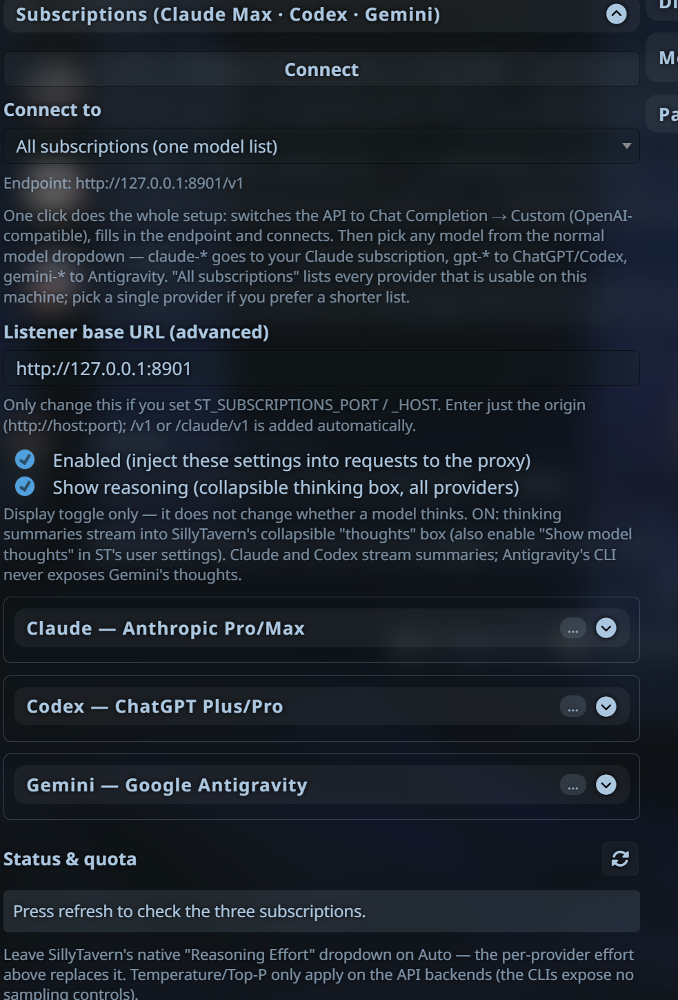
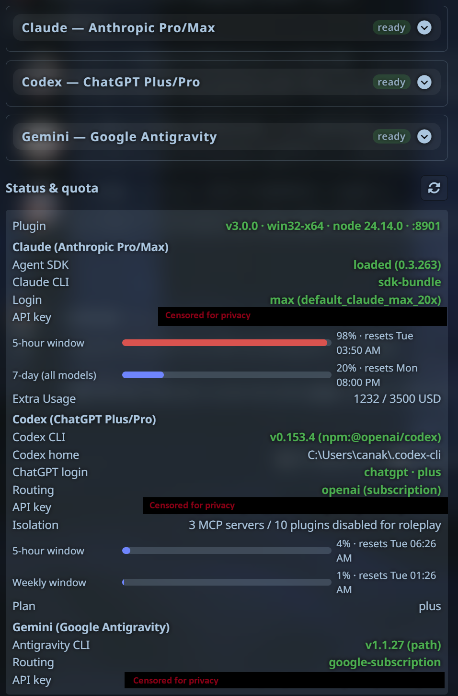

# SillyTavern — Subscriptions (Claude Max · Codex · Gemini)

Use the AI subscriptions you already pay for in SillyTavern — **Claude
Pro/Max**, **ChatGPT Plus/Pro (Codex)** and **Google Antigravity (Gemini)** —
through one server plugin and one panel, instead of per-token API keys. Each
provider also has an opt-in pay-per-token "API" backend (your own vendor key,
or any compatible relay via a base URL) for when a subscription window is used up.

This is the successor of the three separate plugins
(SillyTavern-ClaudeSubscription, SillyTavern-CodexSubscription,
SillyTavern-GeminiSubscription). One listener, one model list, one panel;
pick the provider by picking the model. You do not need all three
subscriptions — whichever you are logged into on the SillyTavern machine
shows up, the rest stay out of the way.

<p align="center">
  
  
</p>

## Quick start

1. Server plugin, from your SillyTavern folder (the one with `server.js`):

   ```bash
   node plugins.js install https://github.com/LukaTheHero/SillyTavern-Subscriptions
   cd plugins/SillyTavern-Subscriptions
   npm install
   ```

2. Panel: in SillyTavern, **Extensions → Install extension**, paste the same
   URL (this gives you the Update / Delete buttons). The extension dialog only
   installs the panel — the server half always needs step 1.
3. Log in to whichever you use, as the same OS user that runs SillyTavern:
   `claude auth login` (Claude Pro/Max), `codex login` (ChatGPT Plus/Pro), or run
   `agy` once (Google Antigravity).
4. Restart SillyTavern, hard-refresh, open **Extensions → Subscriptions**,
   press **Connect**, pick a model.

**Updating from 3.0.x:** SillyTavern pulls the new code on restart, but it
does not install dependencies. Run `npm install` inside
`plugins/SillyTavern-Subscriptions` once — 3.1 needs the newer Claude Code CLI
for Opus 5.5 — then restart. Also make sure Gemini's agy is 1.2.11 or newer
(`agy update`) and the Codex CLI is current (`npm i -g @openai/codex@latest`,
tested with 0.154) — older ones are refused because the roleplay isolation
depends on them.

Details, migration from the old plugins, and every setting: below. What
changed: [CHANGELOG.md](CHANGELOG.md).

## What you get

- **One endpoint, every subscription** — `claude-*`, `gpt-*` and `gemini-*`
  models in one dropdown, each routed to its own backend. Or connect to a
  single provider from the panel if you want a shorter list.
- **Claude** — Opus 5.5/5/4.8/4.7/4.6/4.5, Fable 5.1/5, Sonnet 5.5/5/4.6/4.5,
  Haiku 4.5. Fable, Opus 4.7+ and Sonnet 5+ run with their full 1M context;
  Opus 4.6 and Sonnet 4.6 have explicit **(1M context)** entries. Reasoning
  effort `low…max`, thinking modes, real multi-turn context via session resume
  (prompt caching works), live 5-hour / 7-day quota meter, OAuth auto-refresh.
- **Codex** — the live model list from your ChatGPT account with per-model
  reasoning efforts, verbosity, the Fast/priority service tier, and streamed
  replies **and** reasoning summaries through the Codex app-server. Your
  character card is the *real* system prompt; Codex's tools are switched off.
- **Gemini** — Antigravity's model list (Gemini 3.8/3.7/3.6 Flash, 3.1 Pro,
  each with its effort levels), long chats piped safely to the CLI, every turn
  run by a plugin-owned agent with no tools.
- **Subscription only by default.** Nothing but your logins is ever billed
  unless you opt in: per provider you can switch to *Auto* or *API key only*
  (see the panel reference for what Auto means per provider). Any
  Anthropic/OpenAI-compatible relay works by setting a base URL. On Claude,
  the plugin checks before every request that the CLI really authenticated
  with your subscription login (not a stored Console key or another provider).
- **Roleplay isolation.** No coding preamble, no tools, no MCP servers, no
  CLAUDE.md / AGENTS.md / GEMINI.md, skills or rules from your machine, no
  account email. (What you cannot switch off: the Claude CLI adds a short note
  with the working directory — a folder inside the plugin — the platform,
  shell, OS, the model name and today's date; agy adds your local time.)
- **The model you picked is the model that answers.** A safety refusal comes
  back as an error — never silently retried, never answered by a different
  model.
- **Stop sequences enforced server-side** (`\n{{user}}:` guards work on every
  backend), SillyTavern's max response length respected on Claude and on the
  API backends (the reply ends with `finish_reason: length`; the Codex
  app-server and agy have no output cap), thinking displayed in SillyTavern's
  native reasoning box, clear error messages, a status panel that shows
  exactly what each provider sees.
- **Windows, Linux, macOS and Termux (Android)** — see the Termux note below.

## Prerequisites

On the machine that runs SillyTavern (same OS user as `server.js`):

| Provider | Install | Sign in |
| --- | --- | --- |
| Claude | nothing extra — the Claude Code CLI ships inside the plugin's Agent SDK | `claude auth login` (macOS or headless: `claude setup-token` → `CLAUDE_CODE_OAUTH_TOKEN`, a long-lived token). No global `claude`? Use the bundled one: `node_modules/@anthropic-ai/claude-agent-sdk-<platform>-<arch>/claude auth login` inside the plugin folder |
| Codex | `npm i -g @openai/codex` (or the native installer), a current version | `codex login` with your ChatGPT account |
| Gemini | Antigravity CLI 1.2.11+ from https://antigravity.google/cli | run `agy` once and complete the browser sign-in |

You only need the providers you want. SillyTavern `config.yaml` must have
`enableServerPlugins: true`.

## Install

The repo is two things at once: the **server plugin** (the proxy) and the
**"Subscriptions" panel** (a normal UI extension, `manifest.json` at the
root). Install both from GitHub so SillyTavern's own buttons can update and
remove them later.

**1. Server plugin** — from your SillyTavern directory (the one containing
`server.js`):

```bash
node plugins.js install https://github.com/LukaTheHero/SillyTavern-Subscriptions
cd plugins/SillyTavern-Subscriptions
npm install
```

(Linux/macOS/Termux: `bash plugins/SillyTavern-Subscriptions/install.sh` does
the `npm install` and prints a doctor report.) SillyTavern git-pulls server
plugins on every boot (`enableServerPluginsAutoUpdate`), or run
`node plugins.js update`; after an update that changes dependencies run
`npm install` again.

**2. Panel** — in SillyTavern: **Extensions → Install extension**, paste

```
https://github.com/LukaTheHero/SillyTavern-Subscriptions
```

The panel then shows up in **Manage extensions** with its own Update and
Delete buttons. (If you skip this step the server plugin drops a copy of the
panel into `third-party/SillyTavern-Subscriptions-UI` on startup; that copy has
no update button, which is why the dialog install is recommended. Once the
dialog-installed panel exists, the server plugin retires its own copy.)

**Migrating from the old plugins:** remove `plugins/SillyTavern-ClaudeSubscription`
(it uses the same port 8901), and delete the old panels in **Manage
extensions** — `SillyTavern-ClaudeSubscription`, `SillyTavern-CodexSubscription`,
`SillyTavern-GeminiSubscription`, plus any `SillyTavern-ClaudeMax` /
`SillyTavern-CodexMax` / `SillyTavern-GeminiAntigravity` folders in
`public/scripts/extensions/third-party/`. The new panel imports your old
effort/thinking settings on first load.

Restart SillyTavern. The log should show:

```
[subscriptions] UI extension already installed via SillyTavern's extension installer — auto-install skipped
[subscriptions] standalone listener: http://127.0.0.1:8901/v1 (per-provider: /claude/v1, /codex/v1, /gemini/v1)
[subscriptions] initialised — endpoint http://127.0.0.1:8901/v1
```

Hard-refresh the browser (Ctrl+F5) after the first install.

## Connect

1. Extensions drawer → **Subscriptions**.
2. "Connect to": *All subscriptions* (one list) or a single provider.
3. **Connect**. The Custom (OpenAI-compatible) source is configured and
   connected for you. Your saved Custom API key is left alone.
4. Pick a model from SillyTavern's normal model dropdown. Chat.

Settings in the panel apply from the next message — no reconnect needed.

### Panel reference

| Section | Setting | Notes |
| --- | --- | --- |
| Global | Show reasoning | Display only. Streams thinking summaries into ST's reasoning box (also enable **Request model reasoning** in ST's AI Response Configuration). Claude and Codex stream summaries; Antigravity's CLI never exposes Gemini thoughts. |
| Claude | Backend | **Subscription only (default)** — only your Claude login is ever billed, never an API key (checked before each request). If Extra Usage is enabled on your Claude account, requests past your plan window — and Fast mode / the 4.6 "(1M context)" entries — are billed as Extra Usage; turn it off in your account settings if you don't want that. *Auto* — the subscription first; the API key is used for a request only when your plan's usage window is exhausted or rate limiting persists after retries (never just because a key exists). *API key* — keys from ST's Custom API key field, `ST_SUBSCRIPTIONS_CLAUDE_API_KEY`, `ANTHROPIC_API_KEY` / `ANTHROPIC_AUTH_TOKEN`, or `~/.claude/settings.json`'s env block; `ST_SUBSCRIPTIONS_CLAUDE_BASE_URL` / `ANTHROPIC_BASE_URL` points at a relay (a real `sk-ant-` key is never sent to a relay URL that only sits in settings.json). Your OAuth login is never modified. |
| | Reasoning effort | `low … max`. Auto = the model's default (Opus 5.5 / Sonnet 5.5: medium, Opus 4.7: xhigh, most others: high). Levels a model lacks step down automatically; Haiku 4.5, Sonnet 4.5 and Opus 4.5 take no effort. |
| | Thinking mode | Adaptive / On / Off. Fable, Opus 5.5 and Sonnet 5.5 always think (Off is ignored there); Off works on every other model. On forces a fixed thinking budget where a model allows one (Opus/Sonnet 4.6 and the 4.5 models); on newer models it behaves like Adaptive. Thinking counts toward the max response length. |
| | Session resume | On (recommended): real multi-turn session + prompt caching. |
| | Identity mode | Adds one line naming the exact model (for cards that ask the model who it is). No coding preamble. |
| | Fast mode | Opus 4.8 / 5 / 5.5 only. Draws Extra Usage credits (billed separately, not your plan window). |
| Codex | Backend | **Subscription only (default)** — needs a ChatGPT login; an API-key login in Codex is refused, never billed, and so is a `config.toml` that points `openai_base_url` / `chatgpt_base_url` at a non-OpenAI host. *Auto* runs the Codex CLI exactly as configured — a relay provider or an API-key login there is billed on every request — and uses a key directly only when the CLI is missing or signed out. *API* uses `OPENAI_API_KEY` (+ `OPENAI_BASE_URL` for a relay) directly. |
| | Reasoning effort | Clamped to the model's supported levels. |
| | Verbosity | Default (medium) / low / high. |
| | Service tier | Standard / Fast (priority) / Ultrafast where offered. |
| | Reasoning summary | auto / concise / detailed / none. |
| Gemini | Backend | **Antigravity CLI only (default)** — your Google sign-in. If agy's own settings route it to a Gemini API key or relay, Subscription refuses; *Auto* runs agy as configured (a key or relay there is billed on every request) and uses a key directly only when agy is missing. *API* uses `GEMINI_API_KEY` / `GOOGLE_API_KEY` with Google's endpoint, or `GOOGLE_GEMINI_BASE_URL` for a relay. |
| | Reasoning effort | Overrides the `-high/-medium/-low` suffix where the model offers that level (Gemini 3.1 Pro: High and Low). |
| Status & quota | Refresh | Per provider and per selected backend: CLI found (with version), login state, routing, key availability, Claude 5h/7d windows (plus per-model weekly caps and Extra Usage), Codex rate limits. |

Leave SillyTavern's native **Reasoning Effort** dropdown on *Auto*; the panel
replaces it. Temperature/Top-P are forwarded only on Gemini's API backend (the
CLIs expose no sampling controls).

**Background requests.** Requests that extensions send through a Connection
Manager profile (summaries, trackers, guided generations and other quiet
requests) do not carry the panel's settings. They get the plugin's built-in
defaults: the subscription backend (never an API key), adaptive thinking, the
model's default effort, fast mode off.

## Endpoints

| Method | URL | Purpose |
| --- | --- | --- |
| GET | `http://127.0.0.1:8901/status` (`?deep=1`) | Health of all providers |
| GET | `http://127.0.0.1:8901/v1/models` | Unified model list (usable providers) |
| GET | `http://127.0.0.1:8901/{claude,codex,gemini}/v1/models` | One provider's list |
| GET | `http://127.0.0.1:8901/v1/usage/quota` | Claude windows + Codex rate limits |
| POST | `http://127.0.0.1:8901/v1/chat/completions` | Chat (SSE + JSON), routed by model id |
| POST | `…/{provider}/v1/chat/completions` | Same, provider forced for unknown ids |
| POST | `…/v1/embeddings` | Always `501` |
| GET | `http://<sillytavern>/api/plugins/subscriptions/status` | Same-origin health for the panel |

Direct API users can send the `subscriptions` object shown in
`docs/DESIGN.md`, the legacy `claude_subscription` / `codex_subscription` /
`gemini_subscription` objects, or plain OpenAI `reasoning_effort` / `verbosity`.

**Access.** The listener only answers requests whose Host is `localhost`,
`127.0.0.1` or `[::1]` (this blocks DNS-rebinding pages). Keep
`ST_SUBSCRIPTIONS_HOST` at `127.0.0.1` — SillyTavern talks to the plugin over
loopback anyway. If you really bind it elsewhere, `ST_SUBSCRIPTIONS_TOKEN` is
required and every request must send it as an `X-Subscriptions-Token` header
(SillyTavern: Custom connection → **Include Headers**); without a token the
listener refuses to start, because anyone who can reach it could spend your
subscriptions.

## Environment overrides

| Variable | Default | Purpose |
| --- | --- | --- |
| `ST_SUBSCRIPTIONS_PORT` / `_HOST` | `8901` / `127.0.0.1` | Listener |
| `ST_SUBSCRIPTIONS_TOKEN` | – | Required when `_HOST` is not loopback (see **Access**) |
| `ST_SUBSCRIPTIONS_ALLOWED_HOSTS` | – | Extra Host names accepted on the loopback listener (comma-separated) |
| `ST_SUBSCRIPTIONS_NO_UI_INSTALL` | – | `1` skips the UI auto-install |
| `ST_SUBSCRIPTIONS_LIST_ALL_MODELS` | – | `1` lists every provider even when unusable here |
| `ST_SUBSCRIPTIONS_CLAUDE_PATH` | – | Explicit `claude` executable (legacy name `CLAUDE_SUBSCRIPTION_CLAUDE_PATH`) |
| `ST_SUBSCRIPTIONS_CLAUDE_USE_RESUME` | `1` | `0` forces the fold path |
| `ST_SUBSCRIPTIONS_CLAUDE_MAX_TURNS` | `1` | SDK maxTurns |
| `ST_SUBSCRIPTIONS_CLAUDE_ISOLATE_ACCOUNT` | `1` | `0` lets the CLI use its own login store (it then adds your account email to prompts) |
| `ST_SUBSCRIPTIONS_CLAUDE_API_KEY` / `_BASE_URL` | – | Claude API backend |
| `ST_SUBSCRIPTIONS_CODEX_PATH` | – | Explicit `codex` executable (legacy name `CODEX_PATH`) |
| `ST_SUBSCRIPTIONS_CODEX_HOME` | CLI default (`CODEX_HOME` or `~/.codex`) | Codex home to use |
| `ST_SUBSCRIPTIONS_CODEX_API_KEY` / `_BASE_URL` | – | Codex API backend |
| `ST_SUBSCRIPTIONS_AGY_PATH` | – | Explicit `agy` executable (legacy name `AGY_PATH`) |
| `ST_SUBSCRIPTIONS_AGY_SANDBOX` | `1` | `0` runs agy turns without `--sandbox` (if the sandbox fails on your OS) |
| `ST_SUBSCRIPTIONS_AGY_TIMEOUT_MS` / `_FIRST_OUTPUT_MS` / `_IDLE_MS` | `600000` / `240000` / `120000` | agy watchdogs |
| `ST_SUBSCRIPTIONS_GEMINI_API_KEY` / `_BASE_URL` | – | Gemini API backend |

The vendors' own variables are picked up automatically for the API backends:
`ANTHROPIC_API_KEY` / `ANTHROPIC_AUTH_TOKEN` / `ANTHROPIC_BASE_URL`,
`OPENAI_API_KEY` / `OPENAI_BASE_URL`, `GEMINI_API_KEY` / `GOOGLE_API_KEY` /
`GOOGLE_GEMINI_BASE_URL`. A key typed into SillyTavern's Custom API key field
goes to the vendor's own endpoint unless the matching `ST_SUBSCRIPTIONS_*_BASE_URL`
is set. Changing the port? Update **Listener base URL** in the panel.

## Linux & Termux

- Linux/macOS: install Node 18+, then the steps above. CLIs are found on PATH,
  in `~/.local/bin`, `~/.codex/bin`, `~/.agy/bin`, `/usr/local/bin`,
  `/opt/homebrew/bin` and the global npm `node_modules`. macOS logins kept in
  the Keychain are used as-is.
- Termux: `pkg install nodejs-lts git`, install SillyTavern as usual, then the
  steps above. **Claude does not run natively on Termux** — Claude Code
  publishes no Android build. The same npm packaging may skip Codex's Linux
  binary there (`npm i -g @openai/codex --force`, or set
  `ST_SUBSCRIPTIONS_CODEX_PATH`), and agy on Android is untested. The
  dependable route for all three is running SillyTavern inside
  `proot-distro` (Debian/Ubuntu). `npm run doctor` inside the plugin folder
  shows what was detected.

## Troubleshooting

- **`npm run doctor`** (inside the plugin folder) prints what the plugin sees:
  CLIs, logins, keys, catalogs, and whether each provider's default backend is
  ready. `npm run doctor -- --deep` adds Codex account/rate limits.
- **"does not support this model; version … or newer is required"** — the
  Claude CLI is too old: `npm install` in the plugin folder and restart
  SillyTavern (or, if you set `ST_SUBSCRIPTIONS_CLAUDE_PATH` / use a global
  `claude`, update that one — the error names which CLI it was).
- **"Claude login unavailable"** — the plugin reads your login token to keep
  your account email out of prompts, and could not read or refresh it. Run
  `claude` once (refreshes the login), or on macOS / a headless host create a
  long-lived token with `claude setup-token` and set `CLAUDE_CODE_OAUTH_TOKEN`
  for SillyTavern. `ST_SUBSCRIPTIONS_CLAUDE_ISOLATE_ACCOUNT=0` lets the CLI
  use its own login instead (it then adds your email to prompts).
- **"Billing guard: the Claude CLI would have used …"** — on "Subscription
  only" the CLI picked a stored Console API key or another provider instead
  of your subscription login. Nothing was sent. Remove that credential, or
  choose the API backend if you meant to pay per token.
- **"… declined this request (safety classifier …)"** — the model's own
  safety classifier refused the message. Nothing was retried or moved to
  another model: reword, regenerate, go back a message, or pick another model.
- **Codex "would inject AGENTS.md …, so chats are refused"** — Codex adds the
  `AGENTS.md` from its home to every prompt, and there is no switch for it.
  Empty that file, or give the plugin its own Codex home: log in once with
  `CODEX_HOME=<dir> codex login` (PowerShell: `$env:CODEX_HOME="<dir>"; codex login`)
  and set `ST_SUBSCRIPTIONS_CODEX_HOME=<dir>`. Enabled MCP servers in that
  home's `config.toml` need simple names (letters, digits, `_`, `-`) so they
  can be switched off, or `enabled = false`.
- **Codex "not signed in with a ChatGPT account"** — the Codex home has no
  ChatGPT login (or an API-key login): `codex login` with your ChatGPT account,
  or set `ST_SUBSCRIPTIONS_CODEX_HOME` to the home that has one.
- **Gemini "agy is configured to bill an API key"** — agy's `settings.json`
  routes it to a key or relay. Switch the Gemini backend to *Auto* to allow
  that, or remove `modelProvider` / `GOOGLE_GEMINI_BASE_URL` there to use your
  Google sign-in.
- **Port 8901 in use** — the old SillyTavern-ClaudeSubscription plugin is still
  installed; remove it.
- **Model list empty for a provider** — that provider is not usable on this
  host (no CLI and no key). Check the status panel / doctor.
- **Auth errors mid-chat (Claude)** — the plugin refreshes the OAuth token
  before and, once, during a request; if it keeps failing, run
  `claude auth login` as the SillyTavern user.
- **A "(1M context)" chat suddenly fails as too long** — if your plan has no
  Extra Usage for 1M, the plugin runs the request at 200k and tries 1M again
  after an hour (the server log says so).

## Development

```bash
npm test                          # unit tests
node test/integration.js          # standalone listener on :8911, status + model lists
LIVE=1 node test/integration.js   # + one tiny chat per ready provider (spends subscription quota)
BACKEND=auto LIVE=codex node test/integration.js   # opt in to key/relay billing for a test
```

## License

[GNU AGPL v3.0 or later](LICENSE).
